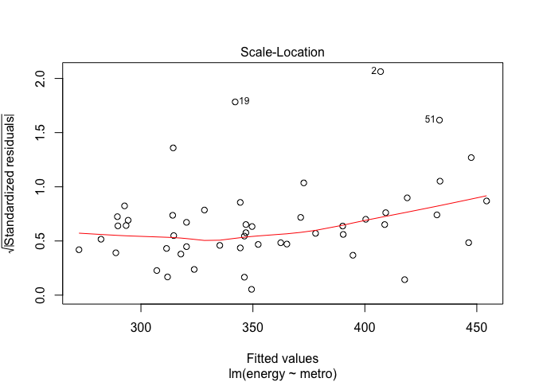

Linear Regression
================

Introduction
------------

• Learning objectives
• Learn the R formula interface
• Specify factor contrasts to test specific hypotheses
• Perform model comparisons
• Run and interpret variety of regression models in R
• You might also start by listing the files in your working directory

``` r
getwd() # where am I?
```

    ## [1] "/Users/jeevarehakrishnaraj/Desktop/Springboard/Project- Linear Regression Mini-Project/linear_regression/Project4"

``` r
list.files("dataSets") # files in the dataSets folder
```

    ## [1] "Exam.rds"   "states.dta" "states.rds"

``` r
## Load the states data

states.data <- readRDS("dataSets/states.rds") 
#get labels
states.info <- data.frame(attributes(states.data)[c("names", "var.labels")])
#look at last few labels
tail(states.info, 8)
```

    ##      names                      var.labels
    ## 14    csat        Mean composite SAT score
    ## 15    vsat           Mean verbal SAT score
    ## 16    msat             Mean math SAT score
    ## 17 percent       % HS graduates taking SAT
    ## 18 expense Per pupil expenditures prim&sec
    ## 19  income Median household income, $1,000
    ## 20    high             % adults HS diploma
    ## 21 college         % adults college degree

### Linear regression

### Examine the data before fitting models

### Start by examining the data to check for problems.

``` r
# summary of expense and csat columns, all rows
sts.ex.sat <- subset(states.data, select = c("expense", "csat"))
summary(sts.ex.sat)
```

    ##     expense          csat       
    ##  Min.   :2960   Min.   : 832.0  
    ##  1st Qu.:4352   1st Qu.: 888.0  
    ##  Median :5000   Median : 926.0  
    ##  Mean   :5236   Mean   : 944.1  
    ##  3rd Qu.:5794   3rd Qu.: 997.0  
    ##  Max.   :9259   Max.   :1093.0

``` r
# correlation between expense and csat
cor(sts.ex.sat)
```

    ##            expense       csat
    ## expense  1.0000000 -0.4662978
    ## csat    -0.4662978  1.0000000

### Plot the data before fitting models

Plot the data to look for multivariate outliers, non-linear relationships etc.

``` r
# scatter plot of expense vs csat
plot(sts.ex.sat)
```


### Linear regression example

• Linear regression models can be fit with the `lm()' function • For example, we can use`lm' to predict SAT scores based on per-pupal expenditures:

``` r
# Fit our regression model
sat.mod <- lm(csat ~ expense, # regression formula
              data=states.data) # data set
# Summarize and print the results
summary(sat.mod) # show regression coefficients table
```

    ## 
    ## Call:
    ## lm(formula = csat ~ expense, data = states.data)
    ## 
    ## Residuals:
    ##      Min       1Q   Median       3Q      Max 
    ## -131.811  -38.085    5.607   37.852  136.495 
    ## 
    ## Coefficients:
    ##               Estimate Std. Error t value Pr(>|t|)    
    ## (Intercept)  1.061e+03  3.270e+01   32.44  < 2e-16 ***
    ## expense     -2.228e-02  6.037e-03   -3.69 0.000563 ***
    ## ---
    ## Signif. codes:  0 '***' 0.001 '**' 0.01 '*' 0.05 '.' 0.1 ' ' 1
    ## 
    ## Residual standard error: 59.81 on 49 degrees of freedom
    ## Multiple R-squared:  0.2174, Adjusted R-squared:  0.2015 
    ## F-statistic: 13.61 on 1 and 49 DF,  p-value: 0.0005631

### Why is the association between expense and SAT scores /negative/?

Many people find it surprising that the per-capita expenditure on students is negatively related to SAT scores. The beauty of multiple regression is that we can try to pull these apart. What would the association between expense and SAT scores be if there were no difference among the states in the percentage of students taking the SAT?

``` r
summary(lm(csat ~ expense + percent, data = states.data))
```

    ## 
    ## Call:
    ## lm(formula = csat ~ expense + percent, data = states.data)
    ## 
    ## Residuals:
    ##     Min      1Q  Median      3Q     Max 
    ## -62.921 -24.318   1.741  15.502  75.623 
    ## 
    ## Coefficients:
    ##               Estimate Std. Error t value Pr(>|t|)    
    ## (Intercept) 989.807403  18.395770  53.806  < 2e-16 ***
    ## expense       0.008604   0.004204   2.046   0.0462 *  
    ## percent      -2.537700   0.224912 -11.283 4.21e-15 ***
    ## ---
    ## Signif. codes:  0 '***' 0.001 '**' 0.01 '*' 0.05 '.' 0.1 ' ' 1
    ## 
    ## Residual standard error: 31.62 on 48 degrees of freedom
    ## Multiple R-squared:  0.7857, Adjusted R-squared:  0.7768 
    ## F-statistic: 88.01 on 2 and 48 DF,  p-value: < 2.2e-16

### The lm class and methods

OK, we fit our model. Now what? Examine the model object:

``` r
class(sat.mod)
```

    ## [1] "lm"

``` r
names(sat.mod)
```

    ##  [1] "coefficients"  "residuals"     "effects"       "rank"         
    ##  [5] "fitted.values" "assign"        "qr"            "df.residual"  
    ##  [9] "xlevels"       "call"          "terms"         "model"

``` r
methods(class = class(sat.mod))[1:9]
```

    ## [1] "add1.lm"                   "alias.lm"                 
    ## [3] "anova.lm"                  "case.names.lm"            
    ## [5] "coerce,oldClass,S3-method" "confint.lm"               
    ## [7] "cooks.distance.lm"         "deviance.lm"              
    ## [9] "dfbeta.lm"

``` r
## Use function methods to get more information about the fit

confint(sat.mod)
```

    ##                    2.5 %        97.5 %
    ## (Intercept) 995.01753164 1126.44735626
    ## expense      -0.03440768   -0.01014361

``` r
# hist(residuals(sat.mod))
```

### Linear Regression Assumptions

Ordinary least squares regression relies on several assumptions,including that the residuals are normally distributed and homoscedastic, the errors are independent and the relationships are linear.

``` r
## Investigate these assumptions visually by plotting your model:

par(mar = c(4, 4, 2, 2), mfrow = c(1, 2)) #optional
plot(sat.mod, which = c(1, 2)) # "which" argument optional
```


### Comparing models

Do congressional voting patterns predict SAT scores over and above expense? Fit two models and compare them:

``` r
# fit another model, adding house and senate as predictors
sat.voting.mod <-  lm(csat ~ expense + house + senate,
                      data = na.omit(states.data))
sat.mod <- update(sat.mod, data=na.omit(states.data))
# compare using the anova() function
anova(sat.mod, sat.voting.mod)
```

    ## Analysis of Variance Table
    ## 
    ## Model 1: csat ~ expense
    ## Model 2: csat ~ expense + house + senate
    ##   Res.Df    RSS Df Sum of Sq      F  Pr(>F)  
    ## 1     46 169050                              
    ## 2     44 149284  2     19766 2.9128 0.06486 .
    ## ---
    ## Signif. codes:  0 '***' 0.001 '**' 0.01 '*' 0.05 '.' 0.1 ' ' 1

``` r
coef(summary(sat.voting.mod))
```

    ##                  Estimate   Std. Error    t value     Pr(>|t|)
    ## (Intercept) 1082.93438041 38.633812740 28.0307405 1.067795e-29
    ## expense       -0.01870832  0.009691494 -1.9303852 6.001998e-02
    ## house         -1.44243754  0.600478382 -2.4021473 2.058666e-02
    ## senate         0.49817861  0.513561356  0.9700469 3.373256e-01

### Exercise: least squares regression

Use the /states.rds/ data set. Fit a model predicting energy consumed per capita (energy) from the percentage of residents living in metropolitan areas (metro). Be sure to 1. Examine/plot the data before fitting the model 2. Print and interpret the model `summary' 3.`plot' the model to look for deviations from modeling assumptions

Select one or more additional predictors to add to your model and repeat steps 1-3. Is this model significantly better than the model with /metro/ as the only predictor?

``` r
## Understanding the summary of the data
sts_sat <- subset(states.data, select = c("metro", "energy"))
summary(sts_sat)
```

    ##      metro            energy     
    ##  Min.   : 20.40   Min.   :200.0  
    ##  1st Qu.: 46.98   1st Qu.:285.0  
    ##  Median : 67.55   Median :320.0  
    ##  Mean   : 64.07   Mean   :354.5  
    ##  3rd Qu.: 81.58   3rd Qu.:371.5  
    ##  Max.   :100.00   Max.   :991.0  
    ##  NA's   :1        NA's   :1

``` r
str(sts_sat)
```

    ## 'data.frame':    51 obs. of  2 variables:
    ##  $ metro : num  67.4 41.1 79 40.1 95.7 ...
    ##  $ energy: int  393 991 258 330 246 273 234 349 NA 237 ...

``` r
# Examine the correlation for the sts_sat
cor(sts_sat)
```

    ##        metro energy
    ## metro      1     NA
    ## energy    NA      1

``` r
# Develop a scatter plot before fitting the model
plot(sts_sat)
```


``` r
# Fit the  regression model
sts_model <- lm(energy ~ metro,  data=states.data) 

# Summarize the results of regression
 summary(sts_model) 
```

    ## 
    ## Call:
    ## lm(formula = energy ~ metro, data = states.data)
    ## 
    ## Residuals:
    ##     Min      1Q  Median      3Q     Max 
    ## -215.51  -64.54  -30.87   18.71  583.97 
    ## 
    ## Coefficients:
    ##             Estimate Std. Error t value Pr(>|t|)    
    ## (Intercept) 501.0292    61.8136   8.105 1.53e-10 ***
    ## metro        -2.2871     0.9139  -2.503   0.0158 *  
    ## ---
    ## Signif. codes:  0 '***' 0.001 '**' 0.01 '*' 0.05 '.' 0.1 ' ' 1
    ## 
    ## Residual standard error: 140.2 on 48 degrees of freedom
    ##   (1 observation deleted due to missingness)
    ## Multiple R-squared:  0.1154, Adjusted R-squared:  0.097 
    ## F-statistic: 6.263 on 1 and 48 DF,  p-value: 0.01578

``` r
# Plot the results of regression 
plot(sts_model)
```



Adding more predictor variables
===============================

``` r
# Adding Income
sts_inc <-  lm(energy ~ metro  + toxic + green + income , data = na.omit(states.data))
summary(sts_inc)
```

    ## 
    ## Call:
    ## lm(formula = energy ~ metro + toxic + green + income, data = na.omit(states.data))
    ## 
    ## Residuals:
    ##      Min       1Q   Median       3Q      Max 
    ## -170.775  -29.158   -8.809   16.697  184.151 
    ## 
    ## Coefficients:
    ##             Estimate Std. Error t value Pr(>|t|)    
    ## (Intercept) 208.7123    65.1961   3.201  0.00257 ** 
    ## metro         0.5650     0.5565   1.015  0.31563    
    ## toxic         2.4716     0.5219   4.736 2.39e-05 ***
    ## green         4.7754     0.5837   8.181 2.63e-10 ***
    ## income       -1.9398     2.1461  -0.904  0.37109    
    ## ---
    ## Signif. codes:  0 '***' 0.001 '**' 0.01 '*' 0.05 '.' 0.1 ' ' 1
    ## 
    ## Residual standard error: 58.79 on 43 degrees of freedom
    ## Multiple R-squared:  0.7688, Adjusted R-squared:  0.7473 
    ## F-statistic: 35.74 on 4 and 43 DF,  p-value: 3.716e-13

``` r
# Compare the models
sts_model <- update(sts_model, data=na.omit(states.data))
anova(sts_model, sts_inc)
```

    ## Analysis of Variance Table
    ## 
    ## Model 1: energy ~ metro
    ## Model 2: energy ~ metro + toxic + green + income
    ##   Res.Df    RSS Df Sum of Sq      F    Pr(>F)    
    ## 1     46 580411                                  
    ## 2     43 148638  3    431774 41.636 8.823e-13 ***
    ## ---
    ## Signif. codes:  0 '***' 0.001 '**' 0.01 '*' 0.05 '.' 0.1 ' ' 1

``` r
coef(summary(sts_inc))
```

    ##               Estimate Std. Error    t value     Pr(>|t|)
    ## (Intercept) 208.712342 65.1961169  3.2013002 2.573492e-03
    ## metro         0.564986  0.5564558  1.0153295 3.156279e-01
    ## toxic         2.471589  0.5219102  4.7356602 2.394024e-05
    ## green         4.775413  0.5837040  8.1812226 2.629009e-10
    ## income       -1.939805  2.1460730 -0.9038858 3.710922e-01

Adding toxic and green significantly increases our Adj. R2 value. The previous model's R2 value was 0.097 versus the current model's 0.747. The first model had only one variable which was significant and when additional predictor variables were added in the new model, metro and income were not significant as compared to toxic and green.

### Interactions and factors

Modeling interactions : Interactions allow us assess the extent to which the association between one predictor and the outcome depends on a second predictor. For example: Does the association between expense and SAT scores depend on the median income in the state?

``` r
#Add the interaction to the model
sat.expense.by.percent <- lm(csat ~ expense*income,
                             data=states.data) 
#Show the results
  coef(summary(sat.expense.by.percent)) # show regression coefficients table
```

    ##                     Estimate   Std. Error   t value     Pr(>|t|)
    ## (Intercept)     1.380364e+03 1.720863e+02  8.021351 2.367069e-10
    ## expense        -6.384067e-02 3.270087e-02 -1.952262 5.687837e-02
    ## income         -1.049785e+01 4.991463e+00 -2.103161 4.083253e-02
    ## expense:income  1.384647e-03 8.635529e-04  1.603431 1.155395e-01

### Regression with categorical predictors

Let's try to predict SAT scores from region, a categorical variable. Note that you must make sure R does not think your categorical variable is numeric.

``` r
# make sure R knows region is categorical
str(states.data$region)
```

    ##  Factor w/ 4 levels "West","N. East",..: 3 1 1 3 1 1 2 3 NA 3 ...

``` r
states.data$region <- factor(states.data$region)
#Add region to the model
sat.region <- lm(csat ~ region,
                 data=states.data) 
#Show the results
coef(summary(sat.region)) # show regression coefficients table
```

    ##                Estimate Std. Error    t value     Pr(>|t|)
    ## (Intercept)   946.30769   14.79582 63.9577807 1.352577e-46
    ## regionN. East -56.75214   23.13285 -2.4533141 1.800383e-02
    ## regionSouth   -16.30769   19.91948 -0.8186806 4.171898e-01
    ## regionMidwest  63.77564   21.35592  2.9863209 4.514152e-03

``` r
anova(sat.region) # show ANOVA table
```

    ## Analysis of Variance Table
    ## 
    ## Response: csat
    ##           Df Sum Sq Mean Sq F value    Pr(>F)    
    ## region     3  82049 27349.8  9.6102 4.859e-05 ***
    ## Residuals 46 130912  2845.9                      
    ## ---
    ## Signif. codes:  0 '***' 0.001 '**' 0.01 '*' 0.05 '.' 0.1 ' ' 1

Again, make sure to tell R which variables are categorical by converting them to factors!

### Setting factor reference groups and contrasts

In the previous example we use the default contrasts for region. The default in R is treatment contrasts, with the first level as the reference. We can change the reference group or use another coding cheme using the \`C' function.

``` r
# print default contrasts
contrasts(states.data$region)
```

    ##         N. East South Midwest
    ## West          0     0       0
    ## N. East       1     0       0
    ## South         0     1       0
    ## Midwest       0     0       1

``` r
# change the reference group
coef(summary(lm(csat ~ C(region, base=4),
                data=states.data)))
```

    ##                        Estimate Std. Error   t value     Pr(>|t|)
    ## (Intercept)          1010.08333   15.39998 65.589930 4.296307e-47
    ## C(region, base = 4)1  -63.77564   21.35592 -2.986321 4.514152e-03
    ## C(region, base = 4)2 -120.52778   23.52385 -5.123641 5.798399e-06
    ## C(region, base = 4)3  -80.08333   20.37225 -3.931000 2.826007e-04

``` r
# change the coding scheme
coef(summary(lm(csat ~ C(region, contr.helmert),
                data=states.data)))
```

    ##                             Estimate Std. Error     t value     Pr(>|t|)
    ## (Intercept)               943.986645   7.706155 122.4977451 1.689670e-59
    ## C(region, contr.helmert)1 -28.376068  11.566423  -2.4533141 1.800383e-02
    ## C(region, contr.helmert)2   4.022792   5.884552   0.6836191 4.976450e-01
    ## C(region, contr.helmert)3  22.032229   4.446777   4.9546509 1.023364e-05

### Exercise: interactions and factors

Use the states data set. 1. Add on to the regression equation that you created in exercise 1 by generating an interaction term and testing the interaction.

1.  Try adding region to the model. Are there significant differences across the four regions?

``` r
#Add the interaction to the model
sat_percent_income <- lm(energy ~ metro*income, data=states.data)
summary(sat_percent_income)
```

    ## 
    ## Call:
    ## lm(formula = energy ~ metro * income, data = states.data)
    ## 
    ## Residuals:
    ##     Min      1Q  Median      3Q     Max 
    ## -274.24  -69.33  -29.98   36.80  417.17 
    ## 
    ## Coefficients:
    ##               Estimate Std. Error t value Pr(>|t|)   
    ## (Intercept)  -330.3633   298.5448  -1.107  0.27423   
    ## metro           9.8421     4.5543   2.161  0.03593 * 
    ## income         26.0871     9.3477   2.791  0.00763 **
    ## metro:income   -0.3685     0.1312  -2.808  0.00728 **
    ## ---
    ## Signif. codes:  0 '***' 0.001 '**' 0.01 '*' 0.05 '.' 0.1 ' ' 1
    ## 
    ## Residual standard error: 132 on 46 degrees of freedom
    ##   (1 observation deleted due to missingness)
    ## Multiple R-squared:  0.2485, Adjusted R-squared:  0.1995 
    ## F-statistic: 5.071 on 3 and 46 DF,  p-value: 0.004065

``` r
sat_regions <- lm(energy ~ region,data=states.data)
summary(sat_regions)
```

    ## 
    ## Call:
    ## lm(formula = energy ~ region, data = states.data)
    ## 
    ## Residuals:
    ##     Min      1Q  Median      3Q     Max 
    ## -162.62  -58.49  -30.62   12.00  585.38 
    ## 
    ## Coefficients:
    ##               Estimate Std. Error t value Pr(>|t|)    
    ## (Intercept)     405.62      39.23  10.339  1.4e-13 ***
    ## regionN. East  -156.50      61.34  -2.552   0.0141 *  
    ## regionSouth     -25.49      52.82  -0.483   0.6317    
    ## regionMidwest   -61.62      56.63  -1.088   0.2822    
    ## ---
    ## Signif. codes:  0 '***' 0.001 '**' 0.01 '*' 0.05 '.' 0.1 ' ' 1
    ## 
    ## Residual standard error: 141.5 on 46 degrees of freedom
    ##   (1 observation deleted due to missingness)
    ## Multiple R-squared:  0.1367, Adjusted R-squared:  0.08041 
    ## F-statistic: 2.428 on 3 and 46 DF,  p-value: 0.07737

``` r
anova(sat_regions)
```

    ## Analysis of Variance Table
    ## 
    ## Response: energy
    ##           Df Sum Sq Mean Sq F value  Pr(>F)  
    ## region     3 145757   48586  2.4282 0.07737 .
    ## Residuals 46 920410   20009                  
    ## ---
    ## Signif. codes:  0 '***' 0.001 '**' 0.01 '*' 0.05 '.' 0.1 ' ' 1

### Adding region to the model

``` r
# change the reference group
sat_regions_add <- lm(energy ~ metro*income + region ,
                data=states.data)
summary(sat_regions_add)
```

    ## 
    ## Call:
    ## lm(formula = energy ~ metro * income + region, data = states.data)
    ## 
    ## Residuals:
    ##     Min      1Q  Median      3Q     Max 
    ## -188.46  -70.99  -29.61   28.45  410.78 
    ## 
    ## Coefficients:
    ##                Estimate Std. Error t value Pr(>|t|)   
    ## (Intercept)   -294.1525   300.1176  -0.980  0.33251   
    ## metro            8.0902     4.5327   1.785  0.08134 . 
    ## income          26.1305     9.2756   2.817  0.00729 **
    ## regionN. East -120.8070    58.9017  -2.051  0.04639 * 
    ## regionSouth      7.0119    51.2324   0.137  0.89178   
    ## regionMidwest  -50.8518    52.4209  -0.970  0.33744   
    ## metro:income    -0.3214     0.1306  -2.460  0.01799 * 
    ## ---
    ## Signif. codes:  0 '***' 0.001 '**' 0.01 '*' 0.05 '.' 0.1 ' ' 1
    ## 
    ## Residual standard error: 128.3 on 43 degrees of freedom
    ##   (1 observation deleted due to missingness)
    ## Multiple R-squared:  0.3364, Adjusted R-squared:  0.2438 
    ## F-statistic: 3.634 on 6 and 43 DF,  p-value: 0.005273

The intial model with interaction variables metro & income had was highly significant as compared to metro alone. The region NE was significant as compared to other region when region was used an indepenent variable. When region is added to the interaction variables NE alone was significant as compared to other regions.
